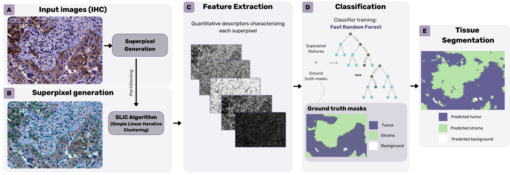
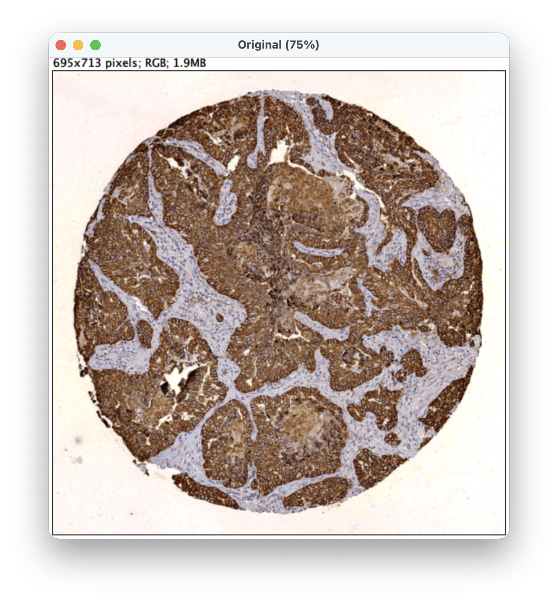
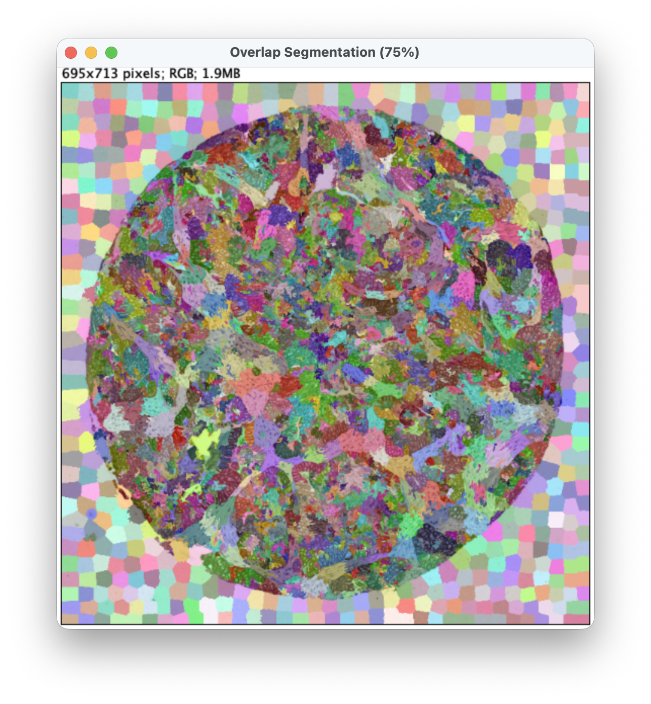
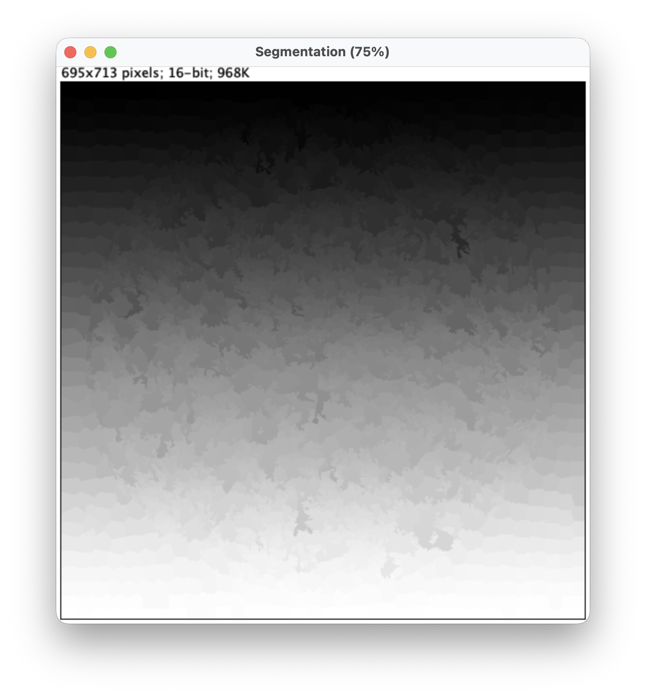

# Trainable Superpixel Segmentation

## Introduction
**Trainable Superpixel Segmentation** (TSS) is an ImageJ 1.x / Fiji plugin that enables supervised image segmentation using features computed on superpixels. The plugin combines superpixel generation (for compact regions), feature extraction (color, texture and morphological features provided by [MorphoLibJ](https://imagej.net/plugins/morpholibj)), and standard classifiers (from [Weka](http://www.cs.waikato.ac.nz/ml/weka/)) so users can train classifiers from annotated superpixels and apply them to new images.



## For users (quick install)

1. Download the latest plugin jar from the GitHub [releases page](https://github.com/CVPD/Trainable_Superpixel_Segmentation/releases) for this project (look for `Trainable_Superpixel_Segmentation-<version>.jar`), for example:
2. Copy the jar into your ImageJ/Fiji `plugins/` directory.
3. Make sure MorphoLibJ is installed in your ImageJ/Fiji instance (you can install it from the ImageJ update site or by copying the MorphoLibJ jar into `plugins/`).
4. Restart ImageJ. The plugin appears under the Plugins menu ("Segmentation > Trainable Superpixel Segmentation").

## For developers (build from source)

Requirements
- Java JDK (8 or later)
- Maven

Build steps
1. From the project root run:

```bash
mvn package
```

2. The build produces a jar under `target/` (for example `target/Trainable_Superpixel_Segmentation-0.0.1-SNAPSHOT.jar`).
3. To test locally, copy that jar into ImageJ's `plugins/` folder and restart ImageJ.

## Tutorial (friendly step-by-step)
This short tutorial helps you use the plugin once it is installed.

### Inputs
The TSS plugin expects two input images:
* A grayscale or RGB image (**original image** to be segmented).
* Its corresponding superpixel image (**label image** resulting from applying a superpixel method to the original image).

<figure align="center">
  
  
  
  <figcaption><i><b>Figure 1:</b> Example of <b>input image</b> (RGB), with corresponding superpixel overlay (from SLIC), and superpixel (segmentation) <b>label image</b>.</i></figcaption>
</figure>

**Note**: Any superpixel segmentation method can be used to produce the label image. In our experiments, we mostly use [SLIC](https://imagej.net/plugins/cmp-bia-tools/#jslic---superpixels).

### Tips for best results
- Label representative superpixels that cover intra-class variability and different images.
- Choose a superpixel size that respects the structures of interest.
- Combine color and texture features for complex textures.
- Try different classifiers and tune hyperparameters if results are unsatisfactory.


Reference
---------
This plugin is part of a final degree project by [Josu Salinas](https://github.com/96jsalinas). The full report (methodology, experiments and results) is available [here](https://addi.ehu.eus/handle/10810/29096). 
