# Trainable Superpixel Segmentation

<p align="center">
  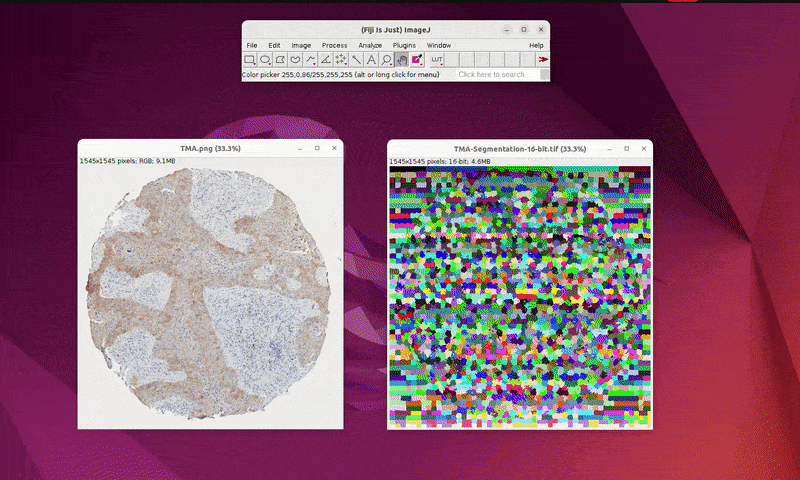
</p>

<p align="center">
  <strong>Interactive image segmentation using trainable classifiers and superpixel-level features.</strong>
</p>

**Trainable Superpixel Segmentation (TSS)** is an ImageJ 1.x / Fiji plugin for interactively
segmenting images by annotating superpixels, training a classifier, and applying it to the image.

## Introduction
Trainable Superpixel Segmentation (TSS) combines **superpixel generation**, **feature extraction**,
and **machine-learning classification** to provide an interactive workflow for image segmentation.
Features describing each superpixel include colour, texture and morphological measurements provided
by [MorphoLibJ](https://imagej.net/plugins/morpholibj), while classification is performed using
standard classifiers from [Weka](http://www.cs.waikato.ac.nz/ml/weka/).

Users can select representative regions directly on the image, assign them to classes, train a
classifier, and apply the resulting model to obtain a segmentation.

<div align="center">
<table>
  <tr>
    <td>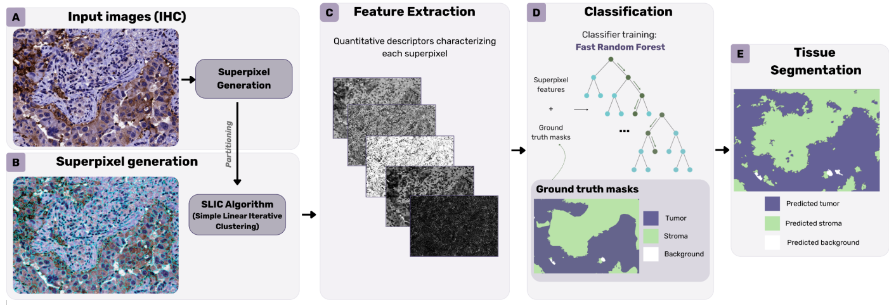</td>
  </tr>
  <tr>
    <td align="center">
    <b>Figure 1:</b> Overview of the Trainable Superpixel Segmentation pipeline: superpixel generation, feature extraction, classifier training and segmentation.
    </td>
  </tr>
</table>
</div>

## Quick install

1. Download the latest plugin jar from the GitHub [releases page](https://github.com/CVPD/Trainable_Superpixel_Segmentation/releases) for this project (look for `Trainable_Superpixel_Segmentation-<version>.jar`), for example: [Trainable_Superpixel_Segmentation-1.0.0.jar](https://github.com/CVPD/Trainable_Superpixel_Segmentation/releases/download/v1.0.0/Trainable_Superpixel_Segmentation-1.0.0.jar)
2. Copy the jar into your ImageJ/Fiji `plugins/` directory.
3. Make sure [MorphoLibJ is installed](https://imagej.net/plugins/morpholibj#installation) in your ImageJ/Fiji instance (you can install it from the ImageJ update site or by copying the MorphoLibJ jar into `plugins/`).
4. Restart ImageJ. The plugin appears under the Plugins menu ("Segmentation > Trainable Superpixel Segmentation").

## Build from source

Requirements
- Java JDK (8 or later)
- Maven

Build steps
1. From the project root run:

```bash
mvn package
```

2. The build produces a jar under `target/` (for example `target/Trainable_Superpixel_Segmentation-0.0.1-SNAPSHOT.jar`).
3. To test locally, copy that jar into ImageJ's `plugins/` folder and restart ImageJ.

## Step-by-step tutorial
This short tutorial helps you use the plugin once it is installed.

### Inputs
The TSS plugin expects two images as input:
1. A grayscale or RGB **input image** (original image to be segmented).
	* To test the plugin, you can use this [sample input image](src/test/resources/TMA.png).
2. Its corresponding **superpixel image** (label image resulting from applying a superpixel method to the original image).
	* To test the plugin, you can use this [sample superpixel image](src/test/resources/TMA-Segmentation-16-bit.zip).

<div align="center">
<table>
  <tr>
    <td>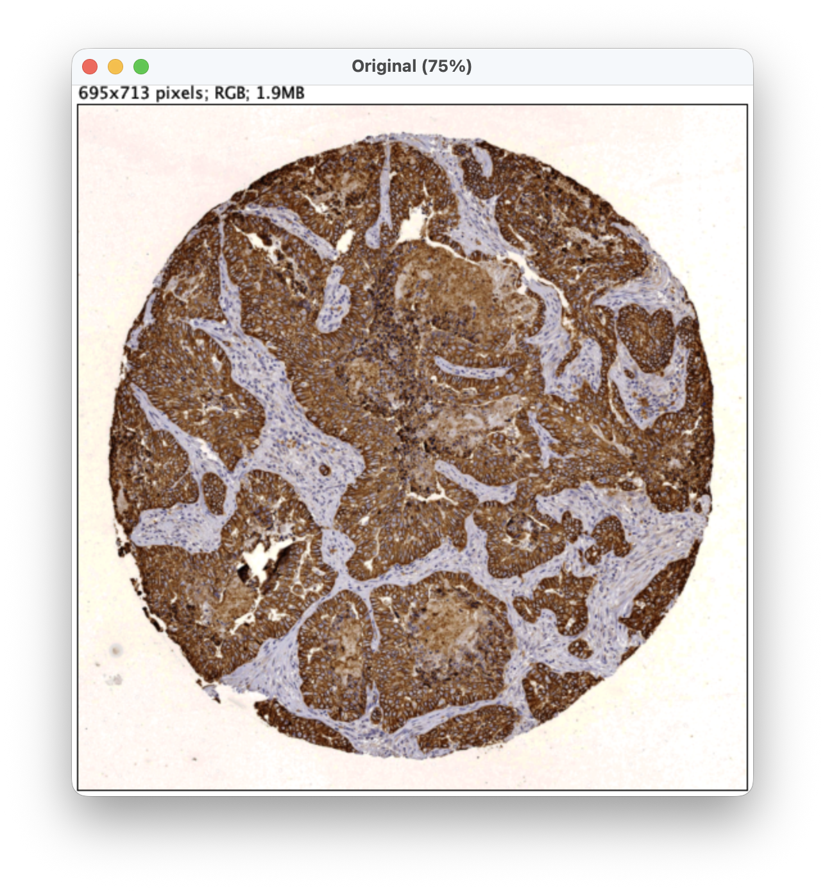</td>
    <td>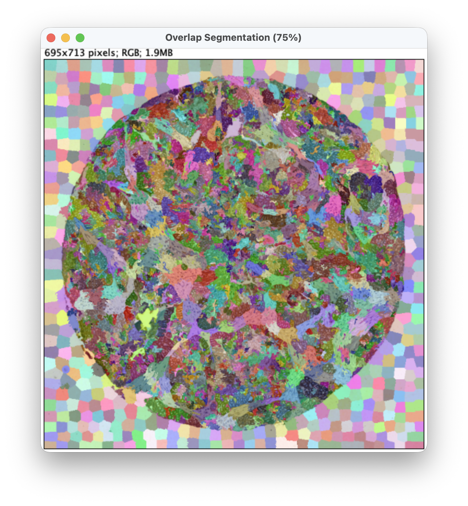</td>
    <td>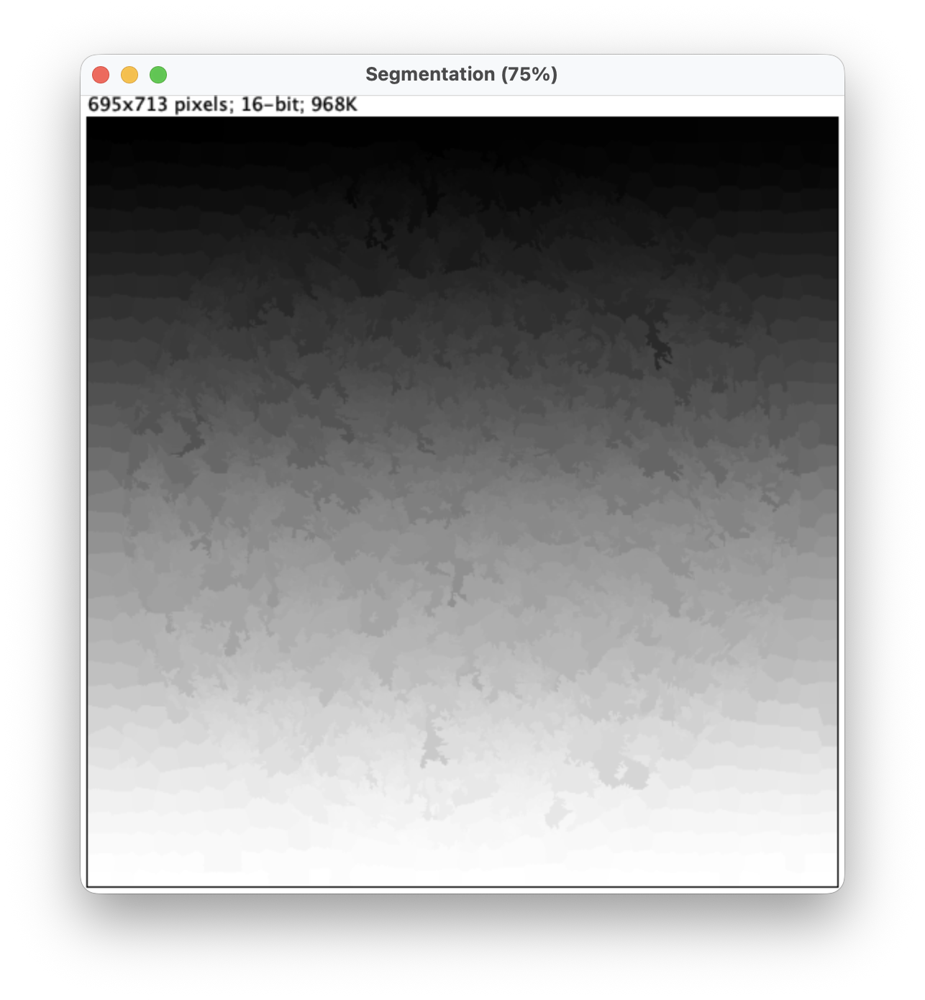</td>
  </tr>
  <tr>
    <td colspan="3" align="center">
    <b>Figure 2:</b> Example of <b>input image</b> (left), with corresponding superpixel overlay from SLIC (center), and <b>superpixel image</b> with segmentation labels (right).
    </td>
  </tr>
</table>
</div>

**Note**: Any superpixel segmentation method can be used to produce the label image. In our experiments, we mostly use [SLIC](https://imagej.net/plugins/cmp-bia-tools/#jslic---superpixels).


### Input dialog
When clicking on *Plugins > Segmentation > Trainable Superpixel Segmentation*, the following dialog will pop up:
<div align="center">
<table>
  <tr>
    <td align="center" width="300">
      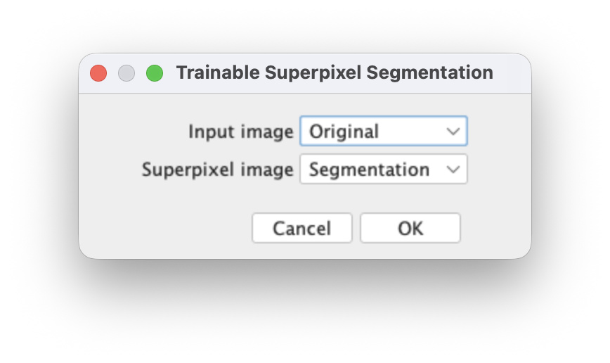      
    </td>
  </tr>
  <tr>
	  <td align="center" width="300">
	      <b>Figure 3:</b> Input dialog to select the input image and its corresponding superpixel (label) image.
	  </td>
  <tr>
</table>
</div>
Select your grayscale or RGB image as "Input image" and your indexed (label) image as "Superpixel image", and click "OK".

**Tip**: For better visualization of the superpixels, you can select a colorful lookup table. Before, calling the plugin, select the label image, click on *Image > Lookup Tables > Glasbey* (or any other lookup table).

### The GUI

After selecting the input and superpixel images, the main GUI of the plugin will pop up:
<div align="center">
<table>
  <tr>
    <td align="center" width="600">
      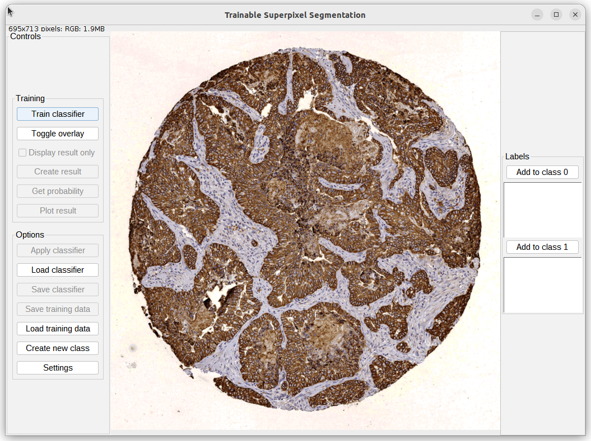
    </td>
  </tr>
  <tr>
    <td align="center" width="600">
  	<b>Figure 4:</b> Main GUI of Trainable Superpixel Segmentation, showing the controls (left), image (center) and labels (right) panels.
  	</td>
  </tr>
</table>
</div>
The Trainable Superpixel Segmentation GUI is organized into three main panels:

1. **Controls panel** — contains the buttons for training and applying classifiers, creating results and probability maps, managing classes, and opening the settings.
2. **Image panel** — displays the input image and, when enabled, an overlay showing the superpixels or the segmentation result. You can also click on the image here to select regions for training.
3. **Labels panel** — contains the available classes and the regions assigned to each class.

The workflow is simple: select representative regions in the image, assign them to classes, train a classifier, and apply it to the image.

#### Controls panel

The controls panel provides the main operations:

- **Train classifier** — trains the selected classifier using the regions assigned to the different classes. The features used for training are those selected in **Settings**.
- **Toggle overlay** — cycles through the available image views:
   1. the original image,
   2. the original image with the superpixel boundaries/labels overlaid, and
   3. the image with the segmentation result overlaid.
   <div align="center">
   <table>
   <tr>
    <td align="center" width="500">
      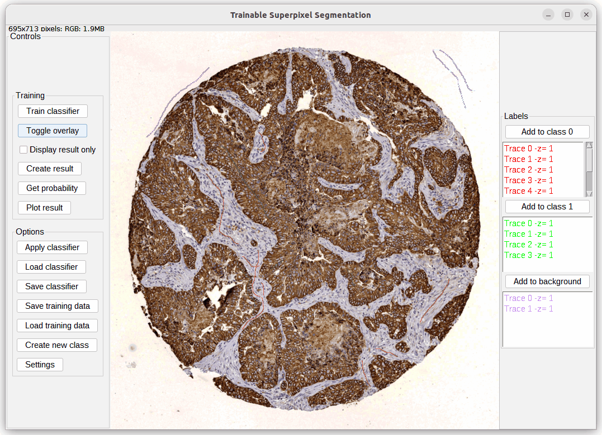
    </td>
   </tr>
   <tr>
    <td align="center" width="500">
  		<b>Figure 5:</b> Toggling between the original image, the superpixel overlay and the segmentation result overlay.
  	</td>
   </tr>
   </table>
   </div>
   If no result has been generated yet, only the first two views are available. Select "Display result only" to skip displaying the superpixels overlay. 
- **Create result** — creates and displays the segmentation result. If a classifier has not yet been trained, the plugin will train one from the selected regions before generating the result.
  <div align="center">
  <table>
  <tr>
    <td align="center" width="400">
      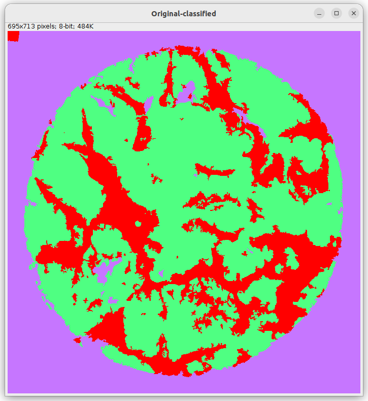
    </td>
  </tr>
  <tr>
    <td align="center" width="400">
      <b>Figure 6:</b> Example of result image generated by the plugin when clicking on "Create result".
    </td>
  </tr>
  </table>
  </div>
- **Get probability** — generates a probability map for each class using the trained classifier. The maps are returned as an image stack, with one slice per class.
  <div align="center">
  <table>
  <tr>
    <td align="center" width="400">
      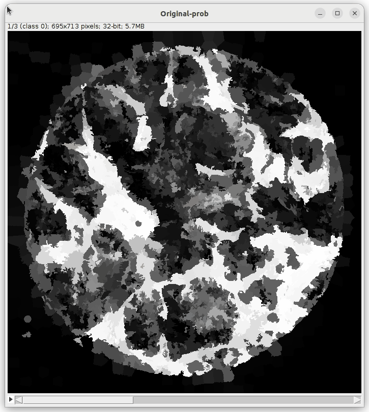
    </td>
  </tr>
  <tr>
    <td align="center" width="400">
      <b>Figure 7:</b> Example of probability image stack generated by the plugin when clicking on "Get probability". Each slice of the stack contains the probability map of one of the classes.
    </td>
  </tr>
  </table>
  </div>
- **Plot result** — opens the statistics window provided by WEKA for the trained classifier.
  <div align="center">
  <table>
  <tr>
    <td align="center" width="300">
      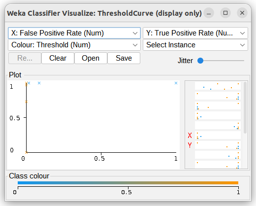
    </td>
  </tr>
  <tr>
    <td align="center" width="300">
      <b>Figure 8:</b> Example of WEKA dialog displayed when clicking on "Plot result".
    </td>
  </tr>
  </table>
  </div>
- **Apply classifier** — applies the current classifier to the image. If no classifier has been trained or loaded, one is trained from the currently selected regions first.
- **Load classifier** — loads a previously saved WEKA classifier from a `.model` file. The plugin reads the classes stored in the model and updates the GUI accordingly.
- **Save classifier** — saves the current classifier as a `.model` file so that it can be reused later.
- **Create new class** — creates an additional class. The new class is added to the Classes panel alongside the default classes.
- **Settings** — opens the settings dialog, where you can select the image features used for training, adjust the overlay opacity, and choose/configure the WEKA classifier.


#### Image panel

The image panel is where you interact with the image and select training examples.

Click on the image to select one or more superpixels. The selected regions can then be assigned to one of the classes using the corresponding **Add to class** button in the Classes panel.

The **Toggle overlay** button is particularly useful here: displaying the superpixel overlay makes it easier to see which region will be selected when you click on the image.

#### Classes panel

The Classes panel contains the classes used for training. Two classes are created by default, and additional classes can be added with **Create new class**.

For each class:

- Click **Add to class** to assign the currently selected regions to that class.
- The list below the button shows the regions already assigned to the class.
- Click an entry in the list to display the corresponding selected point in the image.
- Double-click an entry to remove that region from the class.

Try to select representative regions for each class. Once enough examples have been assigned, click **Train classifier** to train the model.

#### Settings

The **Settings** dialog controls the main parameters used by the plugin:

- **Features** — select which region features are used to represent the superpixels during training and classification.
- **Overlay opacity** — controls the transparency of the superpixel or result overlay. The value can be set from `0` to `1`.
- **Classifier** — select the WEKA classifier and configure its available options.
<div align="center">
<table>
  <tr>
    <td align="center" width="300">
      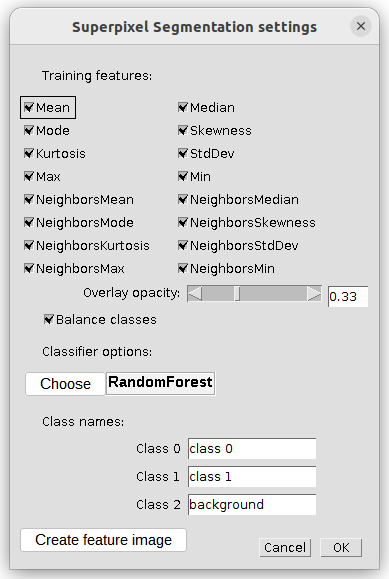
    </td>
  </tr>
  <tr>
    <td align="center" width="300">
      <b>Figure 9:</b> Settings dialog for selecting training features, overlay opacity and the WEKA classifier, and modifying the class names.
    </td>
  </tr>
</table>
</div>
The selected features and classifier are used when training the model.

### Tips for best results
- Label representative superpixels that cover intra-class variability and different images.
- Choose a superpixel size that respects the structures of interest.
- Combine color and texture features for complex textures.
- Try different classifiers and tune hyperparameters if results are unsatisfactory.


Reference
---------
This plugin is part of a final degree project by [Josu Salinas](https://github.com/96jsalinas). The full report (methodology, experiments and results) is available [here](https://addi.ehu.eus/handle/10810/29096). 
